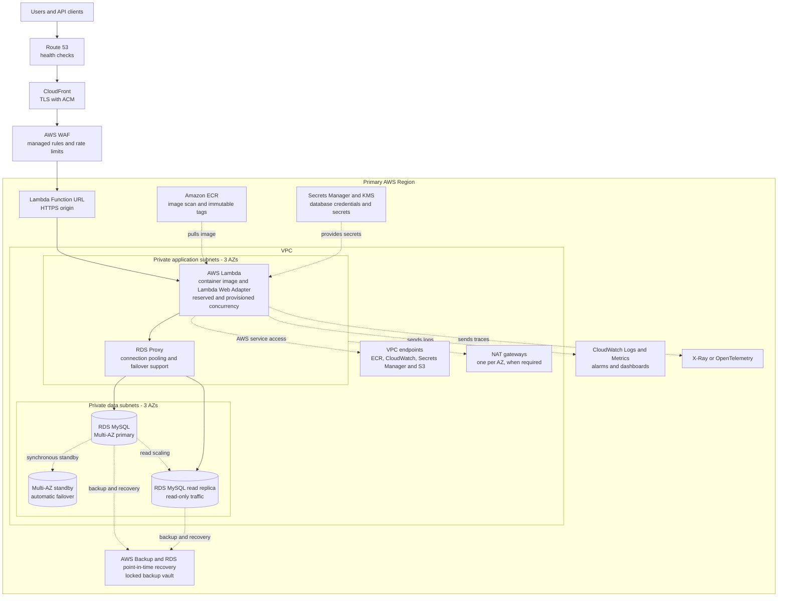

# AWS Deployment Architecture

This document defines a highly available AWS deployment for the API birthday service.
The service uses the current container image and the Lambda Web Adapter.
The design focuses on high availability in one AWS Region.

## Recommended deployment

## Request flow

1. Route 53 sends clients to CloudFront.
2. CloudFront terminates Transport Layer Security.
3. CloudFront sends API traffic to the Web Application Firewall.
4. The Web Application Firewall blocks common attacks and applies rate limits based on client IP address.
5. CloudFront sends allowed requests to the Lambda Function URL.
6. Lambda runs the container image with the Lambda Web Adapter.
7. RDS Proxy manages database connections and database failover.
8. Write operations use the RDS MySQL primary.
9. Read operations can use the RDS MySQL read replica.
